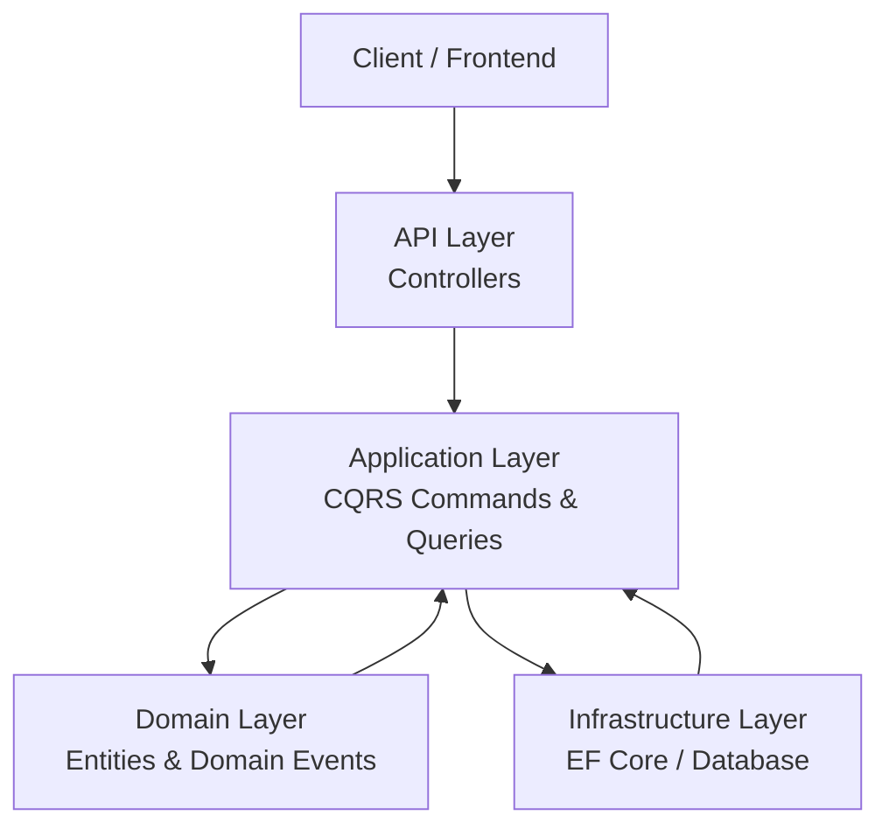
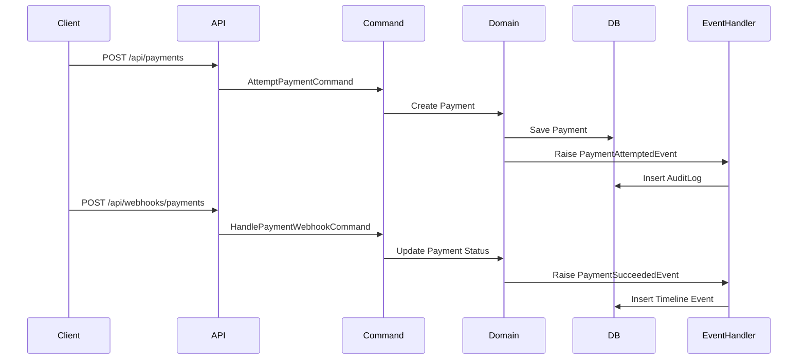

# Multi-Tenant Invoice SaaS API

A production-style backend system built using **ASP.NET Core Clean Architecture + CQRS + Domain Events**.

This project demonstrates how to build a **multi-tenant SaaS backend** with invoice management, payment processing simulation, webhook handling, and activity timelines.

---

# Features

- Multi-Tenant SaaS Architecture
- Invoice Management
- Payment Processing Simulation
- Payment Webhook Handling
- Activity Timeline
- CQRS with MediatR
- Domain Events
- Pagination & Filtering
- Global Exception Handling
- Clean Architecture

---

# Tech Stack

- ASP.NET Core Web API
- Entity Framework Core
- MediatR (CQRS)
- SQL Server
- Swagger / OpenAPI

---

# Architecture

This project follows **Clean Architecture + CQRS + Domain Events**.



---

# Event Flow

Payment processing uses **Domain Events + Event Handlers**.



---

# System Design

## Multi-Tenant Strategy

This system uses **shared database + tenant isolation**.

Each entity implements:

- TenantId
- Global Query Filters
- Tenant Middleware

Flow:

```
TenantMiddleware
      ↓
TenantProvider
      ↓
DbContext Global Filter
      ↓
Tenant Data Isolation
```

This ensures each tenant only accesses its own data.

---

## Payment Processing Flow

```
Client
  ↓
AttemptPaymentCommand
  ↓
Payment Entity Created
  ↓
Domain Event Raised
  ↓
Event Handler
  ↓
AuditLog Timeline
```

Webhook flow:

```
Payment Gateway
   ↓
POST /api/webhooks/payments
   ↓
HandlePaymentWebhookCommand
   ↓
Update Payment Status
   ↓
Raise Domain Event
   ↓
Update Timeline
```

---

## Activity Timeline System

All important events are recorded in **AuditLogs**.

Examples:

- invoice.created
- payment.attempted
- payment.succeeded
- payment.failed

Timeline API:

```
GET /api/invoices/{id}/timeline
```

Example response:

```json
[
  { "eventType": "invoice.created" },
  { "eventType": "payment.succeeded" }
]
```

---

## Pagination Strategy

Invoice listing uses **offset pagination**.

```
GET /api/invoices?page=1&pageSize=10
```

Implementation:

```
Skip((Page - 1) * PageSize)
Take(PageSize)
```

---

# API Endpoints

## Invoices

| Method | Endpoint |
|------|------|
| GET | /api/invoices |
| GET | /api/invoices/{id}/timeline |

## Payments

| Method | Endpoint |
|------|------|
| POST | /api/payments |
| GET | /api/payments/{id} |

## Webhooks

| Method | Endpoint |
|------|------|
| POST | /api/webhooks/payments |

---

# Example API Flow

```
Create Invoice
      ↓
Attempt Payment
      ↓
Payment Webhook
      ↓
Invoice Paid
      ↓
Timeline Updated
```

---


# Future Improvements

Possible production improvements:

- Redis caching
- Background job processing (Hangfire)
- Idempotency key for webhook processing
- Distributed tracing
- Integration tests
- Rate limiting for public APIs

---

# Purpose

This project is built as a **backend architecture showcase** demonstrating how to design scalable SaaS backend systems using modern .NET architecture patterns.

# Author
Hendi Dwi Purwanto

Senior .NET Backend Engineer
